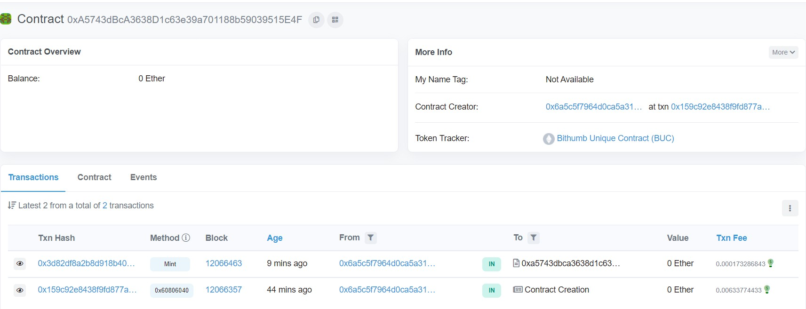
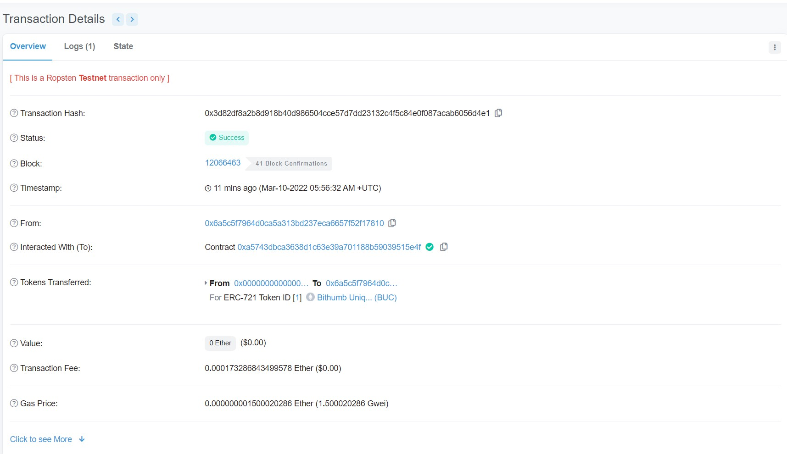
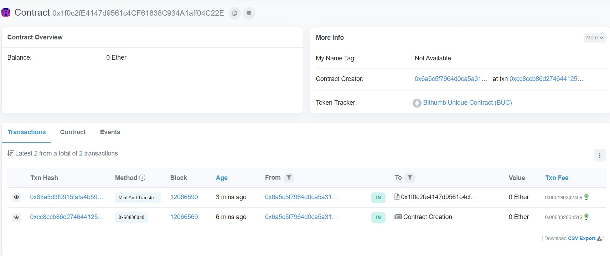
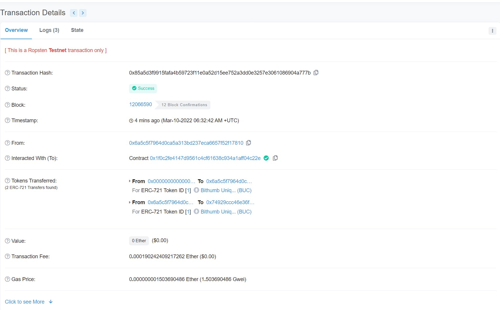
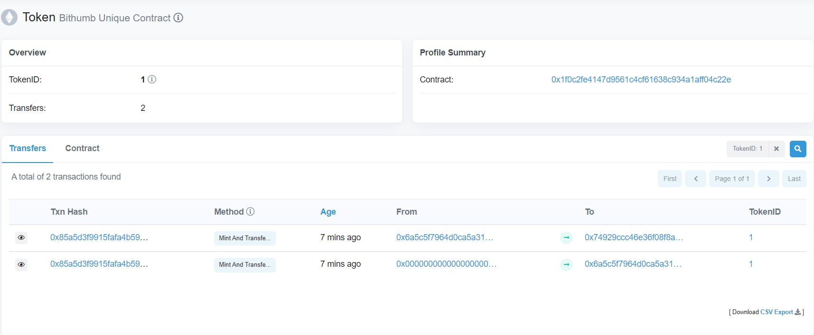
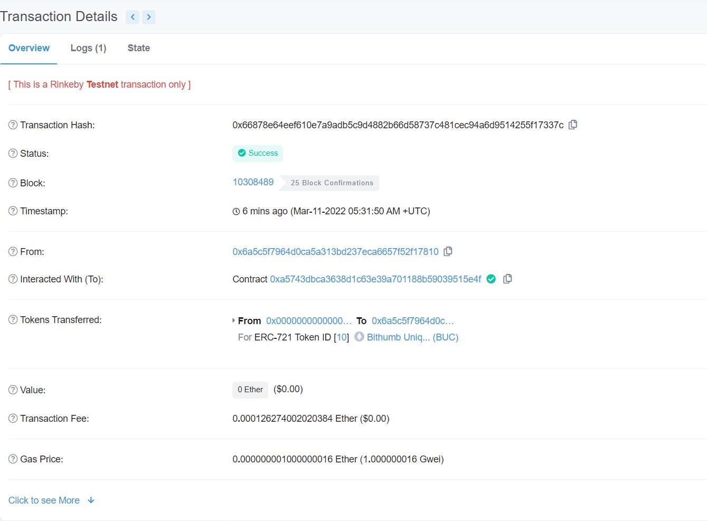
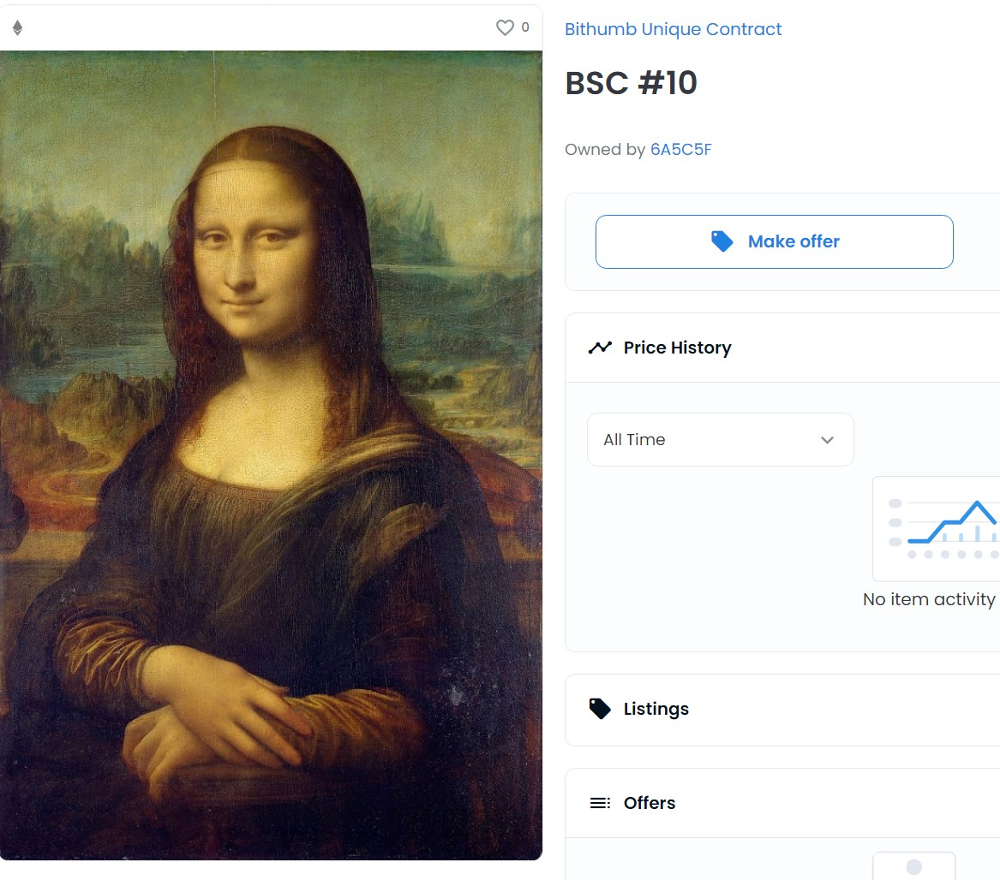

# unique (v1. public only)

## 0. Info
### Infura
|Key|Value|
|:-:|:-:|
|Project ID|5dd62c74a8cb45c1926f431dacf8266a|
|Project Secret|1d2b792d2bfb4fba80991e3d3f016400|
|Endpoint|Ropsten|
|Endpoint https|https://ropsten.infura.io/v3/5dd62c74a8cb45c1926f431dacf8266a|
|Endpoint ws|wss://ropsten.infura.io/ws/v3/5dd62c74a8cb45c1926f431dacf8266a|
|||
|IPFS ID|26Dt5R1BjtIEIqW94fH9JQKykR3|
|IPFS Secret|3127e603416b7c3caeec3277b3594b4f|
|Endpoint|https://ipfs.infura.io:5001|

### Metamask
|network|password|words|
|:-:|:-:|:-:|
|Ropsten|test321!|across pear scale hollow carry useful sort merit jealous undo net faint|

## 1. Workflow
1. Shared contract 배포 (ERC-721)
2. Creator가 offchain에 메타데이터 업로드 후 URI 정보 획득
3. Creator가 mint함수 호출 (owner: creator) 

## 2. Smart contract
- `UniqueSample.sol`
```js
pragma solidity ^0.8.0;

import "@openzeppelin/contracts/token/ERC721/ERC721.sol";
import "@openzeppelin/contracts/token/ERC721/extensions/ERC721URIStorage.sol";
import "@openzeppelin/contracts/utils/Counters.sol";

contract UniqueSample is ERC721URIStorage  {
    using Counters for Counters.Counter;
    Counters.Counter private _tokenIds;

    constructor() ERC721("Bithumb Unique Contract", "BUC") {
    }

    /**
    * Mints 
    */
    function mint(string memory tokenURI) public returns (uint256){
        _tokenIds.increment();

        uint256 newItemId = _tokenIds.current();
        _safeMint(msg.sender, newItemId);
        _setTokenURI(newItemId, tokenURI);

        return newItemId;
    }

}
```

## 3. Compile and Deploy
- compile
```sh
$ npx hardhat compile
```

- `deploy.js`
```js
async function main() {
    const [deployer] = await ethers.getSigners();
  
    console.log("Deploying contracts with the account:", deployer.address);
  
    console.log("Account balance:", (await deployer.getBalance()).toString());
  
    const UniqueSample = await ethers.getContractFactory("UniqueSample");
    const uniqueSample = await UniqueSample.deploy();
  
    console.log("UniqueSample address:", uniqueSample.address);
  }
  
  main()
    .then(() => process.exit(0))
    .catch((error) => {
      console.error(error);
      process.exit(1);
    });

// deploy to hardhat virtual network 
// 실행: npx hardhat run scripts/deploy.js
//  
// deploy to remote test network
// 실행: npx hardhat run scripts/deploy.js --network <network-name>
```

- run
```sh
$ npx hardhat run scripts/deploy.js --network ropsten

Deploying contracts with the account: 0x6A5C5f7964d0cA5a313Bd237ecA6657F52F17810
Account balance: 3000000000000000000
UniqueSample address: 0xA5743dBcA3638D1c63e39a701188b59039515E4F
```

## 4. Interact
- hardhat console을 이용
```sh
$ npx hardhat console --network ropsten

> const Unique = await ether.getContractFactory('UniqueSample')
> const unique = Unique.attach('0xA5743dBcA3638D1c63e39a701188b59039515E4F')
> await unique.mint('https://test.com')
{
  hash: '0x3d82df8a2b8d918b40d986504cce57d7dd23132c4f5c84e0f087acab6056d4e1',
  type: 2,
  accessList: [],
  blockHash: null,
  blockNumber: null,
  transactionIndex: null,
  confirmations: 0,
  from: '0x6A5C5f7964d0cA5a313Bd237ecA6657F52F17810',
  gasPrice: BigNumber { value: "1500020286" },
  maxPriorityFeePerGas: BigNumber { value: "1499955095" },
  maxFeePerGas: BigNumber { value: "1500020286" },
  gasLimit: BigNumber { value: "115523" },
  to: '0xA5743dBcA3638D1c63e39a701188b59039515E4F',
  value: BigNumber { value: "0" },
  nonce: 1,
  data: '0xd85d3d270000000000000000000000000000000000000000000000000000000000000020000000000000000000000000000000000000000000000000000000000000001068747470733a2f2f746573742e636f6d00000000000000000000000000000000',
  r: '0x6af6aecae02dd038261e3567672cf1e7011734bcbe41b605e945b58a43bbfb05',
  s: '0x2ea562d1e3f271d1a4448b333383e1c6a260af9f67b60327ed17c21773823c5b',
  v: 0,
  creates: null,
  chainId: 3,
  wait: [Function (anonymous)]
}
```

- Transaction (https://ropsten.etherscan.io/address/0xa5743dbca3638d1c63e39a701188b59039515e4f)


- Transaction Detail (https://ropsten.etherscan.io/tx/0x3d82df8a2b8d918b40d986504cce57d7dd23132c4f5c84e0f087acab6056d4e1)


## 5. New smartcontract
민팅 후 null -> buyer -> bithumb이 가능한지 실험
- `UniqueSample2.sol'
```js
pragma solidity ^0.8.0;

import "@openzeppelin/contracts/token/ERC721/ERC721.sol";
import "@openzeppelin/contracts/token/ERC721/extensions/ERC721URIStorage.sol";
import "@openzeppelin/contracts/utils/Counters.sol";

contract UniqueSample2 is ERC721URIStorage  {
    using Counters for Counters.Counter;
    Counters.Counter private _tokenIds;

    constructor() ERC721("Bithumb Unique Contract", "BUC") {
    }

    /**
    * Mints 
    */
    function mint(string memory tokenURI) public returns (uint256){
        _tokenIds.increment();

        uint256 newItemId = _tokenIds.current();
        _safeMint(msg.sender, newItemId);
        _setTokenURI(newItemId, tokenURI);
        
        return newItemId;
    }

    /**
    * Mints and Transfer 
    * 민팅 후 즉시 delegator에게 전송
    */
    function mintAndTransfer(address delegator, string memory tokenURI) public returns (uint256){
        _tokenIds.increment();

        uint256 newItemId = _tokenIds.current();
        _safeMint(msg.sender, newItemId);
        _setTokenURI(newItemId, tokenURI);
        _transfer(msg.sender, delegator, newItemId);

        return newItemId;
    }

    /**
    * Mints and event Transfer 
    * only event
    * 실제 전송이 아닌 이벤트만 방출
    * 
    * etherscan과 rarible에는 delegator가 owner인것으로 나온다.
    * 하지만, delegator에게는 권한이 없다.
    * 
    * 실제로 직접 ownerOf함수를 호출하면 msg.sender가 owner로 나온다.
    */
    function mintWithEvent(address delegator, string memory tokenURI) public returns (uint256){
        _tokenIds.increment();

        uint256 newItemId = _tokenIds.current();
        _safeMint(msg.sender, newItemId);
        _setTokenURI(newItemId, tokenURI);
        emit Transfer(msg.sender, delegator, newItemId);

        return newItemId;
    }
}
```

## 6. Interact
- `UniqueSample2.sol` info
```sh
Deploying contracts with the account: 0x6A5C5f7964d0cA5a313Bd237ecA6657F52F17810
Account balance: 2993488968826160388
UniqueSample address: 0x1f0c2fE4147d9561c4CF61638C934A1aff04C22E
```

- interact
```sh
$ npx hardhat console --network ropsten

> const Unique2 = await ethers.getContractFactory('UniqueSample2')
> const unique2 = await Unique2.attach('0x1f0c2fE4147d9561c4CF61638C934A1aff04C22E')
> await unique2.mintAndTransfer('0x74929CCC46E36F08f8ad848AB5189C3e386A13E0', 'https://test.test')
{
  hash: '0x85a5d3f9915fafa4b59723f11e0a52d15ee752a3dd0e3257e3061086904a777b',
  type: 2,
  accessList: [],
  blockHash: null,
  blockNumber: null,
  transactionIndex: null,
  confirmations: 0,
  from: '0x6A5C5f7964d0cA5a313Bd237ecA6657F52F17810',
  gasPrice: BigNumber { value: "1504670771" },
  maxPriorityFeePerGas: BigNumber { value: "1500000000" },
  maxFeePerGas: BigNumber { value: "1504670771" },
  gasLimit: BigNumber { value: "146434" },
  to: '0x1f0c2fE4147d9561c4CF61638C934A1aff04C22E',
  value: BigNumber { value: "0" },
  nonce: 3,
  data: '0x3df0805e00000000000000000000000074929ccc46e36f08f8ad848ab5189c3e386a13e00000000000000000000000000000000000000000000000000000000000000040000000000000000000000000000000000000000000000000000000000000001168747470733a2f2f746573742e74657374000000000000000000000000000000',
  r: '0x172689a86a2b06bef99b3b5479a98176b87005c3d5798e042609e69c1bf0bc17',
  s: '0x1eace24e935b2074bcc793bc5dad7fc861284f457f1aa72dc50e1a5028c7d89c',
  v: 1,
  creates: null,
  chainId: 3,
  wait: [Function (anonymous)]
}
```

## 7. 결과
- Transaction (https://ropsten.etherscan.io/address/0x1f0c2fe4147d9561c4cf61638c934a1aff04c22e)
  - 1번의 transaction 발생



- Transaction detail (https://ropsten.etherscan.io/tx/0x85a5d3f9915fafa4b59723f11e0a52d15ee752a3dd0e3257e3061086904a777b)
  - 2번의 `Tokens Transferred` 발생





- Rinkeby 결과 (https://rinkeby.etherscan.io/token/0xa5743dbca3638d1c63e39a701188b59039515e4f)


## 8. 운영 시나리오
### 8.1. IPFS 업로드
- 이미지 업로드
```sh
# https://docs.infura.io/infura/networks/ipfs/http-api-methods/add

$ curl -X POST -F file=@"/home/jack/ipfs-tutorial/assets/mona.jpg" -u "26Dt5R1BjtIEIqW94fH9JQKykR3:3127e603416b7c3caeec3277b3594b4f" "https://ipfs.infura.io:5001/api/v0/add"

{"Name":"mona.jpg","Hash":"QmVCK8MY9RnoDVg7epYcGZvH89SS4QpEgHA2NsYXRUgtWo","Size":"407913"}
```

- json 업로드
```sh
$ curl -X POST -F file=@"/home/jack/ipfs-tutorial/assets/10.json" -u "26Dt5R1BjtIEIqW94fH9JQKykR3:3127e603416b7c3caeec3277b3594b4f" "https://ipfs.infura.io:5001/api/v0/add"

{"Name":"10.json","Hash":"QmNYSwLDVMLYcSiFGZkw7wNY6jDzXYE2w7cfJKAntgaoW8","Size":"360"}
```

### 8.2. 업로드 확인
```sh
# https://docs.infura.io/infura/networks/ipfs/http-api-methods/get
curl -X POST "https://ipfs.infura.io:5001/api/v0/get?arg=QmNYSwLDVMLYcSiFGZkw7wNY6jDzXYE2w7cfJKAntgaoW8"
```
- IPFS (opensea standard)
  - `ipfs://<Content-Identifier>/<optional path to resource>`
  - e.g. `ipfs://QmNYSwLDVMLYcSiFGZkw7wNY6jDzXYE2w7cfJKAntgaoW8`
- Subdomain
  - `https://<Content-Identifier>.ipfs.infura-ipfs.io/<optional path to resource>`
  - e.g. `https://QmNYSwLDVMLYcSiFGZkw7wNY6jDzXYE2w7cfJKAntgaoW8.ipfs.infura-ipfs.io`
- Path resolution
  - `https://infura-ipfs.io/ipfs/<Content-Identifier>/<optional path to resource>`
  - e.g. `https://infura-ipfs.io/ipfs/QmNYSwLDVMLYcSiFGZkw7wNY6jDzXYE2w7cfJKAntgaoW8`


### 8.3. Mint with URI
```sh
$ npx hardhat console --network rinkeby

> const Unique = await ethers.getContractFactory('UniqueSample2')
> const unique = Unique.attach('0xA5743dBcA3638D1c63e39a701188b59039515E4F')
> await unique.mint('ipfs://QmNYSwLDVMLYcSiFGZkw7wNY6jDzXYE2w7cfJKAntgaoW8')
```

### 8.4. 결과
- etherscan (https://rinkeby.etherscan.io/tx/0x66878e64eef610e7a9adb5c9d4882b66d58737c481cec94a6d9514255f17337c)


- opensea (https://testnets.opensea.io/assets/0xa5743dbca3638d1c63e39a701188b59039515e4f/10)
